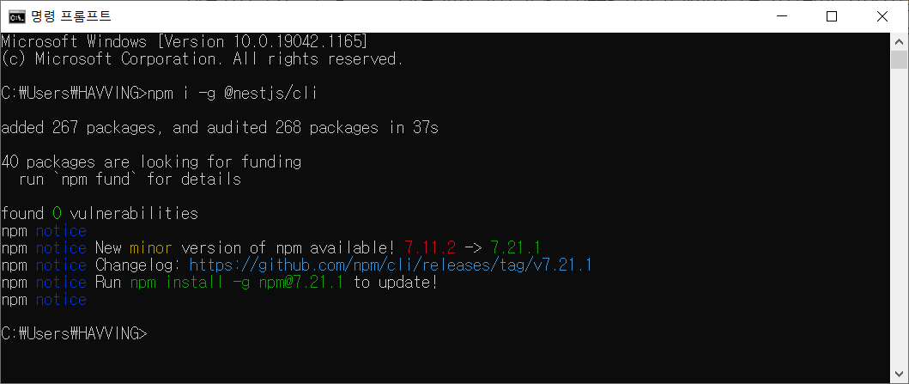
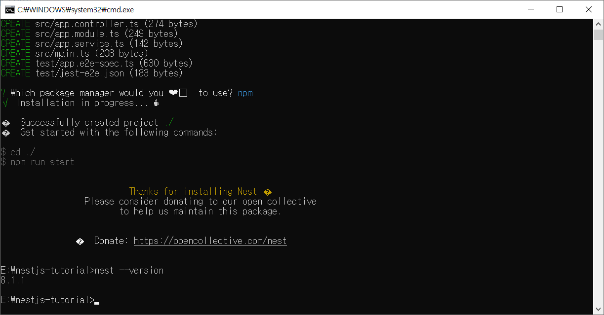
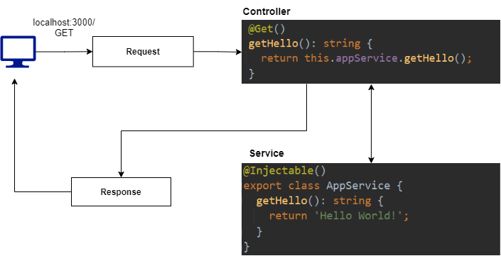
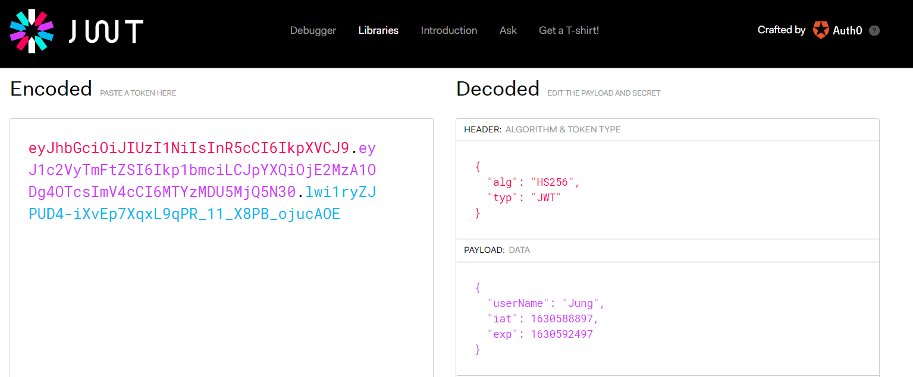

## NestJS

Nest(NestJS)는 효율적이고 확장 가능한 Node.js 서버 측 Application을 구축하기 위한 프레임워크이다.


Progressive JavaScript를 사용하고 TypeScript로 빌드되며, OOP(Object Oriented Progrmming), FP(Functional Programming) 및 FRP(Functional Reactive Programming) 요소를 사용할 수 있게 해준다.


내부적으로 Nest는 Express(기본값)와 같은 강력한 HTTP 서버 프레임워크를 사용하며, 선택적으로 Fastify를 사용하도록 구성할 수 있다. Nest는 이러한 공통 Node.js 프레임워크(Express/Fastify)위에 추상화 수준을 제공하지만, API를 개발자에게 직접 노출한다. 이를 통해 개발자는 기본 플랫폼에서 사용할 수 있는 수많은 타사 모듈을 자유롭게 사용할 수 있다.


Node(및 서버 측 JS)를 위한 훌륭한 라이브러리, 도우미 및 도구가 많이 존재하지만 이들 중 어느 것도 아키텍처의 주요 문제를 효과적으로 해결하지 못한다. Nest는 개발자와 팀이 고도로 테스트 가능하고 확장 가능하며, 느슨하게 결합되고 유지 관리가 쉬운 Application을 만들 수 있는, 즉시 사용 가능한 Application 아키텍처를 제공한다. 이 아키텍처는 Angular에서 영감을 받았다.


공식문서 : https://docs.nestjs.com/ 


<br/>

#### 1일차(8/29)

#### NestJS CLI로 시작하기

프로젝트를 시작할 때 Nest CLI를 이용하면 간단히 프로젝트를 생성할 수 있다.


아래의 명령어로 NestJS를 설치하고, 잘 설치되었는지 확인할 수 있다.

`$ npm i -g @nestjs/cli`

`$ nest --version`

</img>

<br/>

아래의 명령어는 새 프로젝트 디렉토리가 생성되고 초기 핵심 Nest 파일 및 지원 모듈로 디렉토리가 채워져 프로젝트의 기본 구조가 생성된다.

`$ nest new project-name`

</img>

<br/>

##### NestJS 기본 구조

- eslintrc.js : 개발자가 특정한 규칙을 가지고 코드를 깔끔하게 작성할 수 있게 도와주는 라이브러리로, TypeScript를 쓰는 가이드 라인을 제시하고 문법에 오류가 발생하면 알려주는 역할 등을 수행한다.
- prettierrc : 주로 코드 형식을 맞추는 코드 포맷터 역할을 한다. (Indent 값 = 2 or 4, 작은따옴표 or 큰따옴표)
- nest-cli.json : nest 프로젝트를 위해 특정한 설정을 할 수 있는 json 파일
- tsconfig.json : TypeScript 컴파일 방식을 설정하는 json 파일
- tsconfig.build.json : tsconfig.json의 연장선상 파일이며, build를 할 때 필요한 설정들을 명시한다. "excludes"에서는 빌드할 때 필요없는 파일들을 명시한다.
- package.json
  - build : 운영환경을 위한 빌드
  - format : 린트에러 발생 시 수정 
  - start : App 시작
- src 폴더 : 비즈니스 로직이 들어가는 폴더 
  - main.ts : App을 생성하고 실행 
  - app.module.ts : App 모듈 정의


</img>

<br/>

#### 2일차(8/30)

##### Module

모듈은 @module {} 클래스로 이루어져있다. Nest가 Application 구조를 구성하는 데 사용하는 메타 데이터를 제공한다.

각 응용 프로그램에는 하나 이상의 모듈(루트 모듈)이 있다. 루트 모듈은 Nest가 사용하는 시작점이다.

모듈은 밀접하게 관련된 기능 집합으로 구성 요소를 구성하는 효과적인 방법이다.  ex) 유저 모듈, 주문 모듈, 채팅 모듈…

같은 기능에 해당하는 것들은 하나의 모듈 폴더안에 넣어 관리하며, 모듈은 기본적으로 싱글톤이므로 여러 모듈간에 쉽게 공급자의 동일한 인스턴스를 공유할 수 있다.

모듈 생성 명령어는 다음과 같다.

`nest g module [모듈명]`

<br/>

##### Controller

컨트롤러는 들어오는 요청을 처리하고 클라이언트에 응답을 반환한다. 인자로는 **경로**를 받는다.

컨트롤러 생성 명령어는 다음과 같다.

`nest g controller [컨트롤러명] --no-spec`

(--no-spec: 테스트를 위한 소스 코드를 생성하지 않음)

<br/>

##### Handler

핸들러는 @Get, @Post, @Patch, @Delete 등 컨트롤러 클래스 내의 단순한 메서드를 뜻한다.


CLI로 명령어 입력 시 Controlle가 생성되는 순서는 다음과 같다.

1. CLI가 boards 폴더 탐색
2. boards 폴더 안에 controller 파일 생성
3. boards 폴더 안에 module 파일 탐색
4. module 파일 안에 controller 주입

<br/>

##### Providers

대부분의 기본 Nest 클래스 - Service, Repository, Factory, Helper 등 -은 프로바이더로 취급될 수 있다. 프로바이더의 주요 아이디어는 **종속성으로 주입**할 수 있다는 것이다. 즉, 객체는 서로 다양한 관계를 만들 수 있으며 객체의 인스턴스를 **연결**하는 기능은 대부분 Nest 런타임 시스템에 위임될 수 있다.

Provider를 사용하기 위해서는 Nest에 등록해야 한다. module 파일의 providers 항목 안에 해당 모듈에서 사용하고자 하는 Provider를 넣어주면 된다.

<br/>

##### Service

서비스는 S/W 개발 내의 공통 개념으로, **@Injectable**로 모듈에 제공되며, 이 서비스 인스턴스는 Application 전체에서 사용될 수 있다.

서비스는 컨트롤러에서 데이터의 유효성 체크를 하거나 데이터베이스에 아이템을 생성하는 등의 작업을 하는 부분을 처리한다.

서비스 생성 명령어는 다음과 같다.

`nest g service [서비스명] --no-spec`

<br/>

##### DTO(Data Transfer Object)

계층간 데이터 교환을 위한 객체로, DB에서 데이터를 얻어 Service나 Controller 등으로 보낼 때 사용하는 객체를 의미한다.

DTO는 데이터가 네트워크를 통해 전송되는 방법을 정의하는 객체이다.

Interface나 Class를 이용해 정의될 수 있으며, 공식 문서에서는 클래스를 이용하는 것을 권장하고 있다.

클래스는 인터페이스와 달리 런타임에서 작동하기 때문에 파이프와 같은 기능을 사용할 때 더 유용하다.

DTO를 사용하는 이유는 다음과 같다.

- 데이터 유효성을 체크하는 데 효율적이다.

- 더 안정적인 코드로 만들어 주며, TypeScript의 타입으로도 사용된다.

<br/>

#### 3일차(8/31)

##### Pipe

파이프는 @Injectable 클래스로, Data transformation과 Data validation을 위해 사용된다. 컨트롤러 경로 처리기에 의해 처리되는 인수에 의해 작동되며, Nest는 메서드가 호출되기 직전에 파이프를 삽입하고 파이프는 메서드로 향하는 인수를 수신하고 이에 대해 작동한다.

<br/>

**Data transformation**

입력 데이터를 원하는 형식으로 변환한다. (ex. 문자열 → 정수)

**Data validation**

입력 데이터를 평가하고 유효한 경우 변경되지 않은 상태로 전달하면 되지만, 그렇지 않은 경우 데이터가 올바르지 않을 때 예외를 발생시킨다.

파이프는 위 두가지 모든 경우에서 Route Handler가 처리하는 인수에 대해서 작동한다. 

<br/>

**파이프 사용하는 법(Binding Pipes)**

1. Handler-level Pipes
2. Parameter-level Pipes
3. Global-level Pipes

<br/>

**Built-in Pipes**

1. ValidationPipe
2. ParseIntPipe
3. ParseBoolPipe
4. ParseArrayPipe
5. ParseUUIDPipe
6. DefaultValuePipe

<br/>

파이프를 생성할 때 필요한 모듈은 다음과 같다.

- class-validator

- class-transformer

`npm install class-validator class-transformer --save`

※ Pipe 참조문서: https://github.com/typestack/class-validator#manual-validation

<br/>

#### 4일차(9/1)

- PostgresSQL
- pgAdmin(DB Tool)

##### TypeORM

Node.js에서 실행되고 TypeScript로 작성된 객체 관계형 mapper 라이브러리

MySQL, PostgreSQL, MariaDB, SQLite, MS SQL Server, Oracle 등의 여러 데이터베이스 지원

##### ORM(Object Relational Mapping)

객체와 관계형 데이터베이스의 데이터를 자동으로 변형 및 연결하는 작업

ORM을 이용한 개발은 객체와 데이터베이스의 변형에 유연하게 사용할 수 있음

- 모델을 기반으로 데이터베이스 테이블 체계를 자동으로 생성한다.
- 데이터베이스에서 개체를 쉽게 삽입, 업데이트 및 삭제할 수 있다.
- 테입르 간의 매핑(1:1, 1:n, n:m)을 만든다.
- 간단한 CLI명령을 제공한다.
- 간단한 코딩으로 ORM 프레임워크를 사용하기 쉽다.
- 다른 모듈과 쉽게 통합된다.

<br/>

설치해야하는 모듈들

- @nestjs/typeorm : NestJS에서 TypeORM을 사용하기 위해 연동시켜주는 모듈
- typeorm : TypeORM 모듈
- pg : Postgres 모듈

`npm install pg typeorm @nestjs/typeorm --save`

참조문서: https://docs.nestjs.com/techniques/database

<br/>

##### Repository

데이터베이스에 관련된 일은 서비스가 아닌 Repository에서 한다. 이를 Repository Pattern 이라고 부른다.

참조문서: https://typeorm.delightful.studio/classes/_repository_repository_.repository.html

<br/>

#### 5일차(9/2)

##### 인증 기능 구현

유효성 체크 : class-validator 모듈 (https://github.com/typestack/class-validator)


유저를 생성할 때, 이미 사용되고 있는 유저 이름을 사용하려 한다면 에러를 보내는 기능 구현

두 가지 방법

1. repository에서 findOne 메서드를 이용해 이미 같은 유저 이름을 가진 ID가 있는지 확인하고, 없다면 데이터를 저장하는 방법으로, 데이터베이스 처리를 두 번 해야한다는 단점이 있다.
2. 만약 같은 이름을 가진 유저가 있다면 데이터베이스 레벨에서 에러를 던져주는 방법이다.

2번으로 구현하는 것이 효율적이다.

user.entity.ts에서 원하는 필드 값을 유니크한 값으로 정해주면 된다.

```
@Unique(['userName'])
```

에러 발생 시, 그냥 500에러를 던져버리기 때문에 반드시 예외처리를 해줘야 한다.

<br/>

##### 비밀번호 암호화

**bcryptjs** 모듈 사용

`npm install bcryptjs --save`


비밀번호를 DB에 저장하는 방법

1. 원본 비밀번호를 저장하는 방법(최악) ex. 1234 → 1234

2. 비밀번호를 암호화 키(Encryption Key)와 함께 암호화 (양방향)

   (https://www.online-toolz.com/tools/text-encryption-decryption.php)

   암호화 키가 노출되면 알고리즘은 대부분 오픈되어있기 때문에 위험도가 높다.

   ex. 1234 → 암호화(알고리즘+암호화 키) → gUuFwNo4zkMV →  복호화 → 1234

3. SHA256 등으로 해시(Hash)해서 저장(단방향)

   1234 → 03ac674216f3e15c761ee1a5e... → 복호화 X

   레인보우 테이블을 만들어서 암호화된 비밀번호를 비교해서 알아낼 수 있다.

   레인보우 테이블이란,

   1234 => 03ac674216f3e15c761ee1a5e...

   asdf => f0e4c2f76c58916ec258f246851... 등 대부분 유저들은 비슷한 암호를 사용하므로,

   DB에서 같은 해시값을 찾아낼 수 있는 방법이다.

4. **솔트(salt) + 비밀번호(Plain Password)를 해시로 암호화해서 저장**

   암호화할 때 원래 비밀번호에 salt를 붙인 후 해시로 암호화한다.

   1234 => (unique값)_1234

   asdf => (unique값)_asdf

<br/>

##### JWT

로그인을 한 고유 유저를 위한 토큰을 생성할때 JWT 모듈을 사용한다.

JSON Web Token의 약자로, 당사자간에 정보를 JSON 객체로 안전하게 전송하기 위한 컴팩트하고 독립적인 방식을 정의하는 개방형 표준(RFC 7519)이다. 정보를 안전하게 전할 때 혹은 유저의 권한 같은 것을 체크하기 위해서 사용하는데 유용한 모듈이다.

- Header: 토큰에 대한 메타 데이터를 포함 (타입, 해싱 알고리즘 SHA256, RSA...)

- Payload: 유저 정보(issuer), 만료 기간(expiration time), 주제(subject) 등

- Verify Signature: 토큰이 보낸 사람에 의해 서명되었으며 어떤 식으로든 변경되지 않았는지 확인하는데 사용되는 서명이다. 서명은 헤더 및 페이로드 세그먼트, 서명 알고리즘, 비밀 또는 공개키를 사용하여 생성된다.

클라이언트에서 온 Headers + Payload와 서버에서 가지고 있는 Secret Text를 비교해서 Signature 부분을 다시 생성하고, 둘이 일치하면 통과가된다.

<br/>

JWT 설치 모듈

- @nestjs/jwt: nesstjs에서 jwt를 사용하기 위해 필욯나 모듈

- @nestjs/passport: nestjs에서 passport를 사용하기 위해 필요한 모듈

- passport: passport 모듈

- passport-jwt: jwt모듈
- @types/passport-jwt: TypeScript Passport 모듈

`npm install @nestjs/jwt @nestjs/passport passport passport-jwt @types/passport-jwt --save`

JWT 사이트에서 토큰을 입력하면 정보가 출력된다. (https://jwt.io/)

</img>

<br/>

##### NestJS 미들웨어 종류

- Pipes: 요청 유효성 검사 및 페이로드 변환을 위해 만들어진다. 데이터를 예상한대로 직렬화한다.

- Filters: 오류 처리 미들웨어로, 특정 오류 처리기를 사용할 경로와 각 경로 주변의 복잡성을 관리하는 방법을 알 수 있다.

- Guards: 가드는 인증 미들웨어로, 지정된 경로로 통과할 수 있는 사람과 허용되지 않는 사람을 서버에 알려준다.

- Interceptors: 인터셉터는 응답 매핑 및 캐시 관리와 함께 요청 로깅과 같은 전후 미들웨어이다.

미들웨어가 불러지는(called) 순서는 다음과 같다.

1. middleware 
2. guard
3. interceptor(before) 
4. pipe
5. controller
6. service
7. controller
8. interceptor(after)
9. filter(if applicable)
10. client
